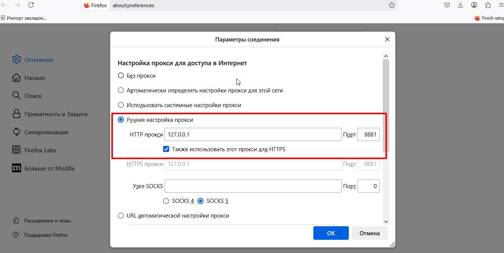

# NoDPI - YouTube Proxy Server с обходом DPI

Высокопроизводительный HTTPS прокси-сервер, предназначенный для обхода систем Deep Packet Inspection (DPI) и обеспечения доступа к YouTube и связанным сервисам.

## 🚀 Особенности

- **HTTPS прокси** - полная поддержка протокола
- **Обход DPI** - фрагментация трафика для обхода блокировок
- **Автозапуск** - автоматический запуск при загрузке системы
- **Встроенный черный список** - блокировка нежелательных доменов
- **Асинхронная архитектура** - высокая производительность
- **Systemd сервис** - интеграция с системой Ubuntu

## 📦 Установка

### 🪟 Windows (рекомендуется для Windows пользователей)

1. Скачайте файл [nodpi_setup.exe](nodpi_setup.exe) из репозитория
2. Запустите установщик от имени администратора
3. Следуйте инструкциям установки
4. После установки на рабочем столе появится иконка "NoDPI"
5. Прокси автоматически запустится и будет работать в фоне

**📖 Подробная инструкция:** [WINDOWS_README.md](WINDOWS_README.md)

**⚠️ Важно для Windows:**
- Иконка на рабочем столе **не интерактивна** (при клике ничего не происходит)
- Прокси работает **автоматически** в фоновом режиме
- Подходит только для браузеров с **собственными настройками прокси**

### 🐧 Linux: Сборка и установка DEB пакета

1. Клонируйте репозиторий:
```bash
git clone https://github.com/Dmitrii111111/youtube-proxy.git
cd youtube-proxy
```

2. Соберите пакет:
```bash
./build_deb.sh
```

3. Установите собранный пакет:
```bash
sudo dpkg -i ../nodpi_1.0.0_all.deb
sudo apt-get install -f  # если есть проблемы с зависимостями
```

### Вариант 2: Установка зависимостей и запуск вручную

Если вы не хотите собирать DEB пакет, можете установить и запустить прокси вручную:

#### 1. Установите зависимости:
```bash
sudo apt update
sudo apt install python3 python3-pip
```

#### 2. Скопируйте файлы в систему:
```bash
# Создайте директории
sudo mkdir -p /usr/local/bin
sudo mkdir -p /usr/local/share/nodpi
sudo mkdir -p /var/log/nodpi

# Скопируйте файлы
sudo cp nodpi.py /usr/local/bin/
sudo cp blacklist.txt /usr/local/share/nodpi/
sudo chmod +x /usr/local/bin/nodpi.py
```

#### 3. Создайте systemd сервис:
```bash
sudo tee /etc/systemd/system/nodpi.service > /dev/null <<EOF
[Unit]
Description=NoDPI YouTube Proxy Server
After=network.target

[Service]
Type=simple
User=nobody
Group=nogroup
ExecStart=/usr/local/bin/python3 /usr/local/bin/nodpi.py
WorkingDirectory=/usr/local/share/nodpi
Restart=always
RestartSec=3

[Install]
WantedBy=multi-user.target
EOF
```

#### 4. Запустите сервис:
```bash
sudo systemctl daemon-reload
sudo systemctl enable nodpi
sudo systemctl start nodpi
```

#### 5. Проверьте работу:
```bash
sudo systemctl status nodpi
sudo netstat -tlnp | grep 8881
```

## 🔧 Управление сервисом

После установки прокси автоматически запускается и работает в фоновом режиме.

### Команды управления:

```bash
# Проверить статус
sudo systemctl status nodpi

# Запустить сервис
sudo systemctl start nodpi

# Остановить сервис
sudo systemctl stop nodpi

# Перезапустить сервис
sudo systemctl restart nodpi

# Включить автозапуск
sudo systemctl enable nodpi

# Отключить автозапуск
sudo systemctl disable nodpi

# Удалить пакет полностью
sudo apt purge nodpi
sudo apt autoremove
```

### Просмотр логов:

```bash
# Логи systemd
sudo journalctl -u nodpi -f

# Логи приложения
sudo tail -f /var/log/nodpi/proxy.log
```

## 🌐 Настройка браузера

После установки прокси работает на `127.0.0.1:8881`

### ⚠️ Важное предупреждение:

**Данный прокси подходит только для браузеров с собственными настройками прокси-сервера!**

#### 🐧 Linux:
- ✅ **Firefox** - работает (собственные настройки)
- ❌ **Chrome/Chromium** - не работает (использует системные настройки)
- ❌ **Edge** - не работает (использует системные настройки)
- ❌ **Системные настройки Ubuntu** - не работают

#### 🪟 Windows:
- ✅ **Firefox** - работает (собственные настройки)
- ❌ **Chrome/Edge** - не работает (использует системные настройки)
- ❌ **Системные настройки Windows** - не работают

### Firefox:
1. Настройки → Настройки Сети → Настройки соединения
2. Выберите "Настроить прокси-сервер вручную"
3. HTTPS прокси: `127.0.0.1`, порт: `8881`
4. Поставьте галочку "Также использовать этот прокси для HTTPS"



**Настройки прокси в Firefox:**
- **HTTP прокси:** `127.0.0.1`
- **Порт:** `8881`
- **Также использовать для HTTPS:** ✅ включено

## 📁 Структура файлов

```
/usr/bin/nodpi.py              # Основной скрипт
/usr/share/nodpi/              # Дополнительные файлы
├── blacklist.txt              # Черный список доменов
└── config.ini                 # Конфигурация
/etc/systemd/system/nodpi.service # Systemd сервис
/var/log/nodpi/                 # Директория логов
```

## 🛠️ Сборка из исходного кода

### Требования:
- Ubuntu 18.04+ или Debian 10+
- build-essential
- devscripts
- debhelper

### Сборка:

```bash
# Установка зависимостей
sudo apt install build-essential devscripts debhelper

# Сборка пакета
chmod +x build_deb.sh
./build_deb.sh
```

## 🔍 Устранение неполадок

### Прокси не запускается:
```bash
# Проверить статус
sudo systemctl status nodpi

# Проверить логи
sudo journalctl -u nodpi -n 50

# Проверить порт
sudo netstat -tlnp | grep 8881
```

### Проблемы с правами доступа:
```bash
# Проверить права на файлы
ls -la /usr/bin/nodpi.py
ls -la /etc/systemd/system/nodpi.service

# Исправить права если нужно
sudo chmod +x /usr/bin/nodpi.py
```

## 📝 Лицензия

Этот проект распространяется под лицензией MIT.

## 🤝 Поддержка

При возникновении проблем:
1. Проверьте логи: `sudo journalctl -u nodpi -f`
2. Убедитесь, что порт 8881 не занят другими приложениями
3. Проверьте, что Python 3.7+ установлен в системе

---